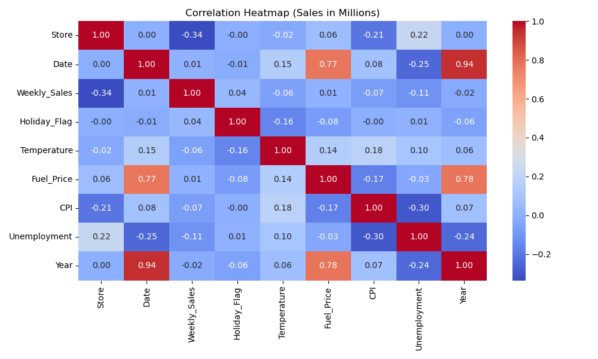
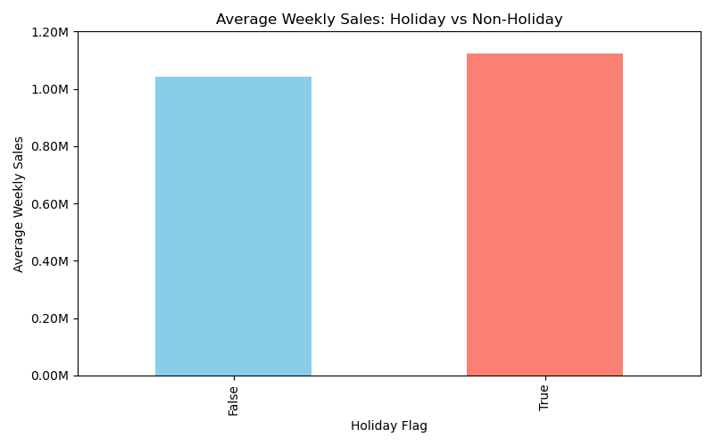
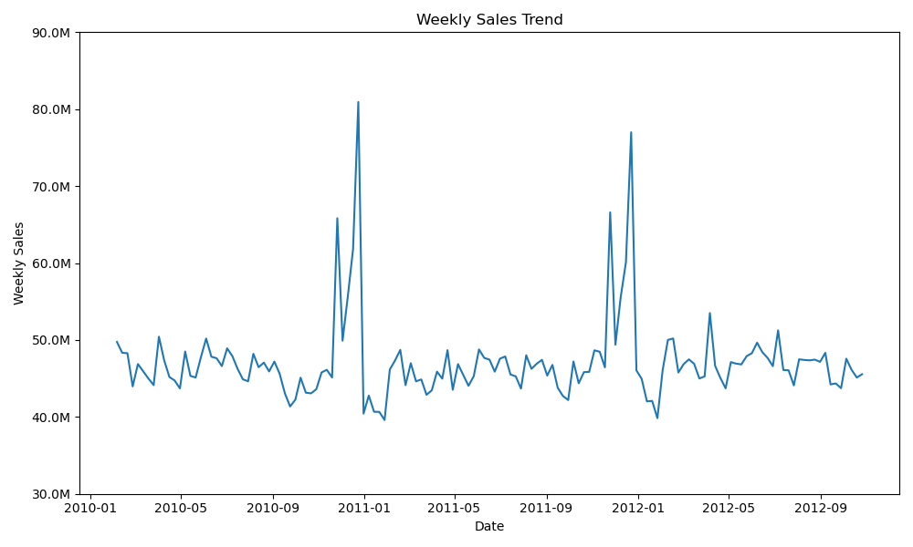

# Walmart Sales Analysis using Python, SQL and Power BI

Analyzed Walmart weekly sales data to identify trends, seasonality,
and holiday impact using Python, SQL, and Power BI.

## Tools Used
- Python (Pandas, Matplotlib)
- SQL
- Power BI
## Insights
- Sales peak during holiday weeks
- Strong increase in Q4 months
- Holiday weeks contribute ~X% of total sales
## Insights
- Sales peak during holiday weeks
- Strong increase in Q4 months
- Holiday weeks contribute ~X% of total sales
## Correlation Heatmap

## Holiday VS Non-Holiday Graph

## Weekly Sales Trend

## Folder structure
This project is organized in a simple and logical way to reflect a real-world data analysis workflow.

data/
Contains the dataset used in this project. The raw data is kept separate from the cleaned version to clearly show the transition from original data to analysis-ready data.

notebooks/
Includes the Python notebook where data cleaning, transformation, and initial analysis were performed using Pandas.

sql/
Holds SQL scripts used to explore the data, calculate key metrics, and extract insights. This folder demonstrates the SQL logic applied during the analysis.

powerbi/
Contains the Power BI dashboard file used to visualize sales trends, holiday impact, and seasonality.

images/
Stores screenshots of the Power BI dashboard that are used for quick preview and documentation in this repository.

README.md
Provides an overview of the project, tools used, key insights, and a visual preview of the dashboard.

requirements.txt
Lists the Python libraries required to run the analysis notebook.
